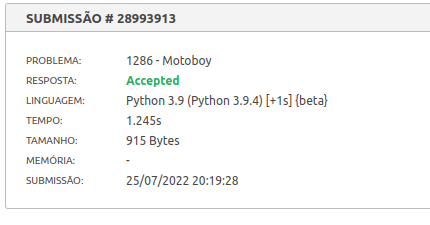
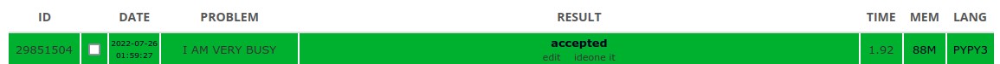

# Greed Solved Exercises

**Conteúdo da Disciplina**: Greed<br>

## Alunos
|Matrícula | Aluno |
| -- | -- |
| 17/0101711  |  Daniel Barcelos Moreira |

## Sobre
O objetivo do projeto é solucionar alguns problemas de juízes online fazendo o uso de algoritmos ambiciosos. 

## Screenshots
### Problema Motoboy
[Link para o problema](https://www.beecrowd.com.br/judge/pt/problems/view/1286)


</figcaption>
    Imagem 1: Accepted URI motoboy
</figcaption>

### Problema Busyman

[Link para o problema](https://www.spoj.com/problems/BUSYMAN/)


</figcaption>
    Imagem 2: Accepted SPOJ busyman
</figcaption>

## Instalação 
**Linguagem**: Python<br>

## Uso 
- Instale o [python 3](https://www.python.org/downloads/);

```
python3 motoboy.py
python3 busyman.py
```


